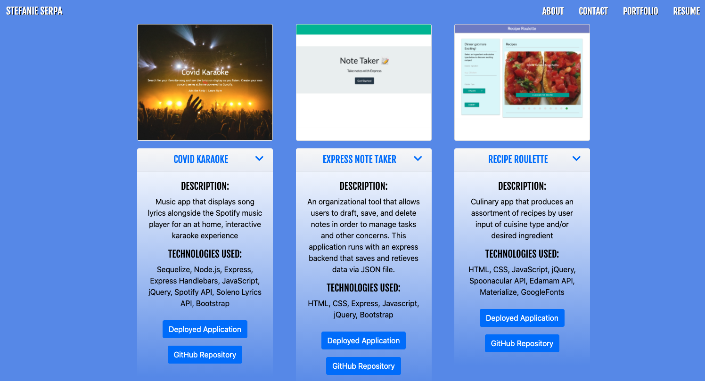

# React Portfolio

## Description

Web Development Portfolio made with React.

## Table of Contents

1. Installation
2. Usage
3. Deployed Application
4. License
5. Contributions




## Installation

To install application dependencies enter the following in the command line:

```
npm install
```

## Usage

To run the application locally, enter the following in the command line:

```
npm run start
```

## Deployed Application

[React Portfolio](https://smserpa.github.io/react-portfolio/#/)


## License


## Contributing

[Stefanie Serpa](https://github.com/smserpa)

